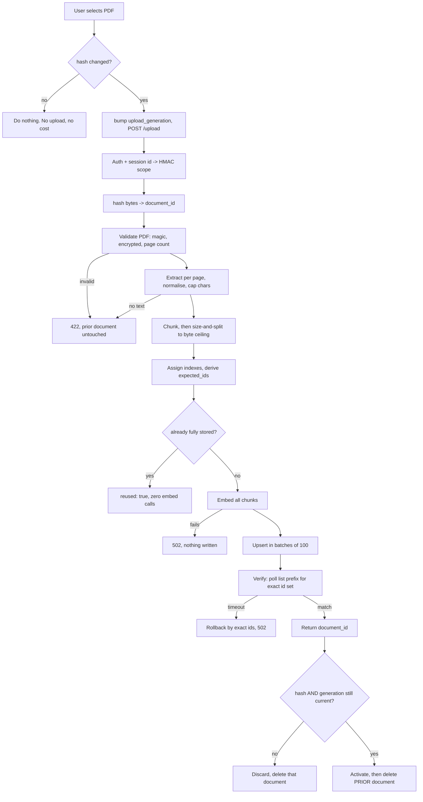
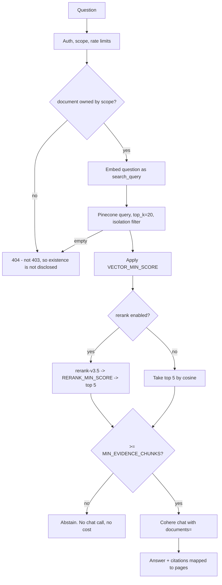

# Architecture

Complete reference for the Gen-AI RAG Interactive QA Bot: what it does, how a
request flows through it, what it is built from, and — most usefully when
returning to it later — **why** each decision was made and what was rejected.

---

## What it is

Upload a PDF, ask questions about it, get answers grounded in that document with
page citations. If the document does not contain the answer, it says so instead of
inventing one.

## Features

| Feature | How it works |
|---|---|
| PDF ingestion | `pypdf` extraction, page-attributed, whitespace-normalised, with validation for encrypted / empty / malformed / image-only files |
| Semantic chunking | ~1200-character overlapping chunks, split per page so citations name an exact page |
| Vector retrieval | Cohere `embed-v4.0` (1024-dim) into Pinecone serverless, cosine metric |
| Asymmetric embedding | Documents embedded as `search_document`, questions as `search_query` |
| Reranking | Retrieve 20 candidates, rerank with `rerank-v3.5`, keep the best 5 |
| Grounded generation | Cohere Chat with `documents=`, so evidence is data rather than prompt text |
| Citations | Page number and snippet per claim, mapped back to stored chunks |
| Abstention | Explicit refusal when no evidence clears the threshold |
| Session isolation | Per-session HMAC scope; concurrent visitors never see each other's documents |
| Transactional replacement | A failed upload never destroys the working document |
| Idempotent re-upload | Identical bytes cost zero embedding calls |
| Demo protection | Passphrase gate, three independent rate-limit domains, upload caps |
| Observability | Structured JSON logs with request correlation and no sensitive fields |
| Containerised | Two images, Compose locally, Render Blueprint in production |

---

## Tech stack, and why

| Layer | Choice | Why this, not something else |
|---|---|---|
| UI | Streamlit 1.51 | The whole point is a demo link. Streamlit gives file upload and chat UI with no frontend build step |
| API | Flask 3.1 + Gunicorn 26 | Already here and entirely adequate. A FastAPI rewrite would have been churn: nothing in this workload needs async, and the async provider SDKs would complicate the retry logic |
| WSGI worker | `gthread`, 2 workers × 4 threads | Requests are I/O-bound on Cohere and Pinecone, so threads are the right lever. Free-tier RAM does not support many processes |
| Embeddings | Cohere `embed-v4.0` @ 1024 dim | The previous default (`embed-english-v2.0`, 4096-dim) was **retired 2026-04-04**. v4.0 supports selectable dimensions; 1024 balances recall against storage |
| Generation | Cohere `command-a-03-2025` | `/v1/generate` was deprecated 2025-09-15 and `command-xlarge-nightly` predates every current release. This model is Cohere's recommended default for RAG |
| Reranking | Cohere `rerank-v3.5` | ~8 lines for a real recall improvement. The cheapest available quality lever, and the direct fix for the retrieval gap |
| Vector store | Pinecone serverless 9.1 | Already here, and its free tier is genuinely adequate. Package renamed from `pinecone-client`; v6+ will not install under the old name |
| PDF | `pypdf` 6 | `PyPDF2` is deprecated and unmaintained |
| Rate limiting | Flask-Limiter, in-memory | No Redis. In-memory is per-worker and approximate, which is an accepted trade at demo scale — documented rather than hidden |
| Config | Environment variables + frozen dataclass | Twelve-factor, and validated at startup so misconfiguration is never a mid-demo 500 |
| Containers | `python:3.12-slim` | Both SDKs require ≥3.10, and `python:3.9` is EOL. Slim cut the backend image from **1.14 GB to 211 MB** |
| Hosting | Render Blueprint | One `render.yaml`, one git push, two services, free tier |

### Deliberately not used

| Rejected | Reason |
|---|---|
| Redis | Only needed for exact cross-worker rate limits. Approximate limits are fine here |
| A database | Nothing to store. Pinecone metadata carries everything |
| LangChain / LlamaIndex | The whole pipeline is ~600 lines of explicit code. A framework would add a large dependency surface and hide the parts worth understanding |
| `tiktoken` | Character-based chunking is adequate and avoids a tokenizer that must stay in sync with whichever embedding model is configured |
| `numpy` | Was used only for L2 normalisation before upsert. Pinecone's cosine metric evaluates similarity, so normalising first is duplicate work |
| Celery / a queue | Ingestion is fast enough to be synchronous, and an async job would need a result store |
| Kubernetes | Two containers |

---

## Layout

```
Backend/
  rag_core/            # pure logic: no Flask, no HTTP, unit-testable
    config.py          #   env -> frozen Settings + 7 startup invariants
    identity.py        #   HMAC session scope derivation
    ids.py             #   deterministic document_id / vector_id
    pdf.py             #   validation, extraction, chunking, split-to-fit
    metadata.py        #   compact-JSON UTF-8 byte measurement
    embeddings.py      #   Cohere embed, asymmetric input_type
    store.py           #   Pinecone; the ONLY source of isolation filters
    rerank.py          #   Cohere rerank
    generation.py      #   Cohere chat with documents= -> citations
    pipeline.py        #   ingest_pdf / answer_question / delete / reset
    clients.py         #   lazy cached SDK clients + error translation
    errors.py          #   typed errors -> HTTP status
  myapp/               # thin Flask adapter
    __init__.py        #   create_app()
    routes.py          #   validate -> pipeline -> serialise
    limits.py          #   three independent rate-limit domains
    http_errors.py     #   uniform error envelope
    observability.py   #   JSON logging, field exclusion
  scripts/             # init_index / cleanup_orphans / smoke_models
  eval/                # calibration + holdout fixtures, run_eval.py
  tests/               # 210 tests, fakes only, no network
Frontend/
  app/app.py           # Streamlit: session_state guards, chat UI, gate
```

`rag_core/` lives under `Backend/` because the Docker build context is `./Backend`
and Docker cannot `COPY` from outside its context.

---

## Request flows

### Ingest



The ordering is the design. Extraction, chunking and sizing are local and free, so
they run first. Embedding — the expensive, failure-prone step — happens before any
write, so a provider outage leaves nothing to clean up. The previous document is
deleted only after the new one is verified *and* adopted by the frontend.

### Ask



---

## Identity and isolation

One fixed namespace, `demo-v1`. Isolation is by metadata, not by namespace.

```
session_scope = HMAC-SHA256(SESSION_SCOPE_KEY, raw_session_id)
document_id   = v{schema}:{scope[:32]}:{file_hash[:32]}
vector_id     = {document_id}:{chunk_index:05d}
```

**Why not a namespace per session?** Pinecone Starter allows 100 namespaces per
index, and nothing reclaims an abandoned one. 100 demo visitors would exhaust the
index.

**Why HMAC rather than the raw session id?** The raw id would otherwise be written
into every vector id and every metadata record. HMAC means the stored scope is
non-reversible, and an attacker who learns a session id still cannot compute the
scope its records live under.

Three properties fall out of the id scheme, and much of the design leans on them:

- **Idempotency.** Same bytes, same scope ⇒ same ids. A retried upsert overwrites
  rather than duplicating, and re-uploading a file costs nothing.
- **Prefix addressability.** `document_id` is a strict prefix of its vector ids, so
  `list(prefix=…)` enumerates one document without knowing its chunk count.
- **Structural ownership.** The scope is *inside* the id, so verifying ownership is
  a string comparison — no lookup, no registry.

Every read and scoped delete goes through `store.isolation_filter()`, the single
place such a filter is constructed, so no call site can forget one:

```python
{"session_scope": {"$eq": scope},
 "document_id":   {"$eq": document_id},
 "ingest_schema_version": {"$in": supported}}
```

---

## The grounding integrity invariant

> **No embedding may represent text absent from the stored metadata and the
> generation context.**

Enforced in three places:

1. `pdf.fit_chunks` **splits** an over-large chunk rather than trimming it. Trimming
   would leave the embedding representing text that is not in storage, so retrieval
   would match on evidence the model never sees and a citation could point at text
   that was never embedded.
2. Chunk indexes and ids are assigned **only after** sizing converges, since a later
   split would renumber everything.
3. `co.embed(truncate="NONE")` makes over-length input an error rather than letting
   Cohere silently truncate server-side.

At the shipped defaults the split path is provably unreachable — invariant 7
guarantees the worst case fits — so reaching it is logged as an anomaly.

---

## Pinecone operation mapping

Pinecone offers several ways to do similar things; these choices are deliberate.

| Purpose | Mechanism | Why |
|---|---|---|
| Ingest verification | `list(prefix=…)`, exact set equality | IDs only, no vector payload. Set comparison catches unexpected extras as well as missing records |
| Rollback | `delete(ids=…)` | Exact known ids, single request (`MAX_CHUNKS ≤ 1000`) |
| Orphan discovery | `list(prefix=…)` | Enumerates a document without knowing its chunk count |
| Retention cleanup | `delete(filter={"created_at": {"$lt": cutoff}})` | One call across many documents. This is why `created_at` is a numeric epoch |
| Per-document delete | `delete(filter=isolation_filter)` | Scoped to the caller |
| Reading content | `fetch(ids=…)` | Only when metadata is genuinely needed |

Verification deliberately **does not** use an unfiltered query,
`describe_index_stats()`, or a sampled record — none can prove a *specific*
document is completely stored.

Pinecone writes are eventually consistent, so verification polls to a bounded
deadline rather than reading once.

---

## API contract

Errors are uniform:

```json
{"error": {"code": "INVALID_PDF", "message": "…", "request_id": "a3f9c1d2"}}
```

| Route | Auth | Success |
|---|---|---|
| `POST /upload` | key + session | `{document_id, file_hash, page_count, chunk_count, reused, upload_generation, request_id}` |
| `POST /ask` | key + session | `{answer, citations[], abstained, request_id, latency_ms}` |
| `POST /documents/delete` | key + session | `{accepted, document_id, request_id}` |
| `POST /reset` | key + session | `{accepted, scope_ref, request_id}` |
| `GET /health` | none | `{status, service}` — no provider call |
| `GET /ready` | optional | authenticated: index + config detail; anonymous: `{ready: bool}` only |

| Status | Meaning |
|---|---|
| 400 | Malformed request |
| 401 | Missing or wrong API key |
| 404 | Unknown document, **or** a document owned by another scope |
| 413 | Upload over `MAX_UPLOAD_MB` |
| 422 | Not a usable text-bearing PDF, or over the chunk budget |
| 429 | Rate limited |
| 502 | Provider failure |
| 503 | Not ready (index missing or incompatible, or Pinecone unreachable) |
| 504 | Provider timeout |

Design notes:

- **Cross-scope access returns 404, not 403.** A 403 would confirm the document
  exists.
- **Delete returns `accepted`, not a count.** Pinecone reports no deleted count and
  deletes are eventually consistent, so a count would be fabricated.
- **`/upload` returns no embedding.** The previous implementation returned the
  entire vector to the browser.
- **`POST /documents/delete`, not `DELETE /documents/{id}`**, because a document id
  contains `:` separators that would need path escaping.
- **`/ready` makes no billable Cohere call.** A probe that spends money per poll is
  a bill, not a check. Model availability is verified by `scripts/smoke_models.py`
  as a deployment gate.

---

## Configuration invariants

Checked at startup; each failure names the offending variables and the arithmetic.

```
1.  0 <= CHUNK_OVERLAP < CHUNK_CHARS
2.  TOP_K >= RERANK_TOP_N >= 1
3.  1 <= MAX_CHUNKS <= 1000                       # rollback stays one request
4.  MAX_EXTRACTED_CHARS <= MAX_CHUNKS*(CHUNK_CHARS-CHUNK_OVERLAP) + CHUNK_OVERLAP
5.  METADATA_MAX_BYTES < 40960                    # Pinecone's hard limit
6.  model ids are currently-served; dimension valid for the model
7.  CHUNK_CHARS*4 + METADATA_OVERHEAD_BUDGET <= METADATA_MAX_BYTES
```

Invariant 4 exists because a chunk budget too small for the character budget would
reject a legal document only *after* paying to embed it. Invariant 7 makes the
metadata split path unreachable at the shipped defaults, which is what keeps
invariant 4's arithmetic sound — splitting produces more chunks than `CHUNK_CHARS`
alone predicts.

Shipped defaults satisfy all seven: `300000 ≤ 320×1000 + 200 = 320200` and
`1200×4 + 2048 = 6848 ≤ 32768`.

Invariant 6 is why a retired model is a startup failure rather than a mid-demo
502 — precisely the failure this project was already suffering from.

---

## Rate limiting

Four limits, all enforced.

| Scope | `/ask` | `/upload` | Evaluated |
|---|---|---|---|
| All requests, per IP | 120/min | 120/min | **middleware** |
| Per trusted IP | 20/min, 120/hr | 5/min, 20/hr | view |
| Per session scope | 10/min, 60/hr | 3/min, 10/hr | view |
| Per process | 500/day | 100/day | view |

**Why a composite key was rejected:** an `ip + session_id` key is trivially
defeated, because session ids are free to mint.

**Why the all-requests limit is separate:** Flask-Limiter resolves
`@limiter.limit` decorators only when the view is actually invoked. A request
rejected earlier — bad API key, malformed session id — never reaches them. Without a
middleware-level limit, `BACKEND_API_KEY` could be brute-forced as fast as the
network allows.

**A trap worth recording:** `Limiter.init_app` begins with
`if not self.enabled: return`. Calling the app factory while the limiter is
disabled silently skips hook registration, and limits then stay off even if it is
re-enabled. `create_app` asserts `"limiter" in app.extensions` to make that loud.

**Honest limitations.** Storage is in-memory, so every limit is **per Gunicorn
worker** and resets on restart or redeploy — with 2 workers the effective ceiling
is up to double. These bound runaway demo spend; they are **not** an enforceable
account-wide provider budget. Exact limits need shared storage, which is out of
scope.

`ProxyFix(x_for=1, …)` is enabled **only** when `TRUST_PROXY=1`, matching Render's
single-proxy topology. Locally there is no proxy, so forwarded headers are not
trusted — otherwise any caller could spoof an IP and defeat the per-IP limit.

---

## Retry and idempotency

| Operation | Retry | Why |
|---|---|---|
| Embed | Yes (SDK) | Stateless |
| Upsert | Yes (SDK) | Deterministic ids make it idempotent |
| Query / list / fetch / rerank | Yes (SDK) | Read-only |
| Delete | Yes (SDK) | Idempotent |
| **Chat generation** | **At most once**, hand-written | See below |

Both SDKs retry internally (`ClientV2(max_retries=…)`,
`Pinecone(retry_config=…)`), so the SDK is configured as the **single** retry layer
— stacking our own on top would multiply attempts (3 × 3 = 9 calls for one logical
request).

Chat is the exception. It uses a client with SDK retries **disabled** and retries
at most once, only on a connection error or an explicit 429/5xx — never on a read
timeout. An accepted-but-slow request may already have been billed and generated,
so retrying risks paying twice for one answer.

---

## Observability

One JSON object per line on stdout.

```json
{"ts":"2026-07-30T10:14:02Z","level":"INFO","event":"ask_ok","request_id":"a3f9c1d2",
 "route":"POST /ask","status":200,"latency_ms":1840,"scope_ref":"9c1e77b04a2f",
 "retrieved_k":20,"reranked_n":5,"top_score":0.87,"abstained":false,
 "model_chat":"command-a-03-2025","provider_latency_ms":1610}
{"ts":"2026-07-30T10:15:11Z","level":"WARNING","event":"request_failed",
 "request_id":"b1c4e0aa","route":"POST /upload","status":422,
 "error_code":"PDF_NO_EXTRACTABLE_TEXT","page_count":12}
{"ts":"2026-07-30T10:16:40Z","level":"ERROR","event":"ingest_rolled_back",
 "request_id":"c7d2f118","reason":"ProviderTimeoutError","ids":180}
```

**Never logged:** API keys, `SESSION_SCOPE_KEY`, raw session ids, document text,
embeddings, or question text (unless `LOG_QUESTIONS=1`, for offline evaluation).

Identity appears only as `scope_ref` (12 hex chars of the HMAC scope) and `doc_ref`
(12 of the file hash) — enough to correlate a session's requests, not enough to be
a handle on its data. The formatter drops known-sensitive keys even if one reaches
a log call by accident, and third-party loggers are pinned to WARNING because
`httpx` logs request bodies at DEBUG.

---

## Testing

210 tests, no network, fakes at the **SDK client** level rather than over our own
functions — so the real `store`, `embeddings` and `generation` code is exercised,
including response-shape handling (`.embeddings.float_`, `list()` pagination,
keyword-only signatures) that is easy to get wrong.

| File | Covers |
|---|---|
| `test_config.py` | All 7 invariants, retired models, secret exclusion |
| `test_identity.py` | Scope derivation, key rotation, id determinism, ownership |
| `test_metadata.py` | Byte measurement across ASCII / CJK / emoji / combining marks |
| `test_pdf.py` | Validation matrix, chunking, overlap, split-to-fit, page attribution |
| `test_grounding.py` | The grounding invariant: embedded text == stored == cited |
| `test_pipeline.py` | Transactionality, rollback, idempotency, isolation, abstention, retry policy |
| `test_routes.py` | HTTP contract, auth, response hygiene, log privacy |
| `test_limits.py` | Bypass cases: rotating session ids, rotating IPs, failed auth |

The fake Pinecone index models **eventual consistency** (`visibility_delay`) and
**pagination**, because both are real behaviours the ingest verification exists to
survive.

---

## Known limitations

| Limitation | Why | Mitigation |
|---|---|---|
| One active document per session | Keeps isolation and UI simple | The data model already supports more |
| No OCR | Scanned PDFs have no extractable text | Clear 422 rather than a bad answer |
| Rate limits approximate | In-memory, per worker | Documented; Redis would fix it |
| Storage not self-bounding | No scheduler | Manual cleanup cadence in DEPLOYMENT.md |
| Cleanup can drop a live session's document | No persistent registry of active documents | Graceful 404 → UI prompts re-upload |
| Free tier cold start ~50 s | Render sleeps idle services | Spinner explains it; Starter removes it |
| Passphrase is shared | A spend guard, not auth | Stated plainly in the UI and docs |
| Character-based chunking | Avoids a tokenizer dependency | Adequate; `CHUNK_CHARS` is tunable |

## Scaling path

Roughly in order of when it would matter:

1. **Remove cold starts** — both services to Render Starter. One line in `render.yaml`.
2. **Exact rate limits** — Redis, and point `Flask-Limiter` at it.
3. **More throughput** — raise gunicorn workers; the app is stateless apart from
   limiter counters.
4. **Better retrieval** — hybrid sparse+dense, or `rerank-v4.0-pro`. Measure on the
   calibration fixture first.
5. **Multi-document sessions** — the data model supports it; the UI and an
   ownership check are the work.
6. **Real auth** — replace the passphrase with per-user accounts, which then makes
   a persistent registry worthwhile and removes the cleanup limitation above.

## Evaluation

Quality is measured, not asserted. Two fixtures with a strictly enforced
separation: `calibration_fixture.yaml` for tuning, `holdout_v1.yaml` as a
single-use gate. See [`Backend/eval/README.md`](Backend/eval/README.md).

The metric that matters most is **unsupported-answer rate** — answering when the
system should have abstained. For a public demo a fabricated answer is worse than
no answer, because the user cannot tell the difference.
